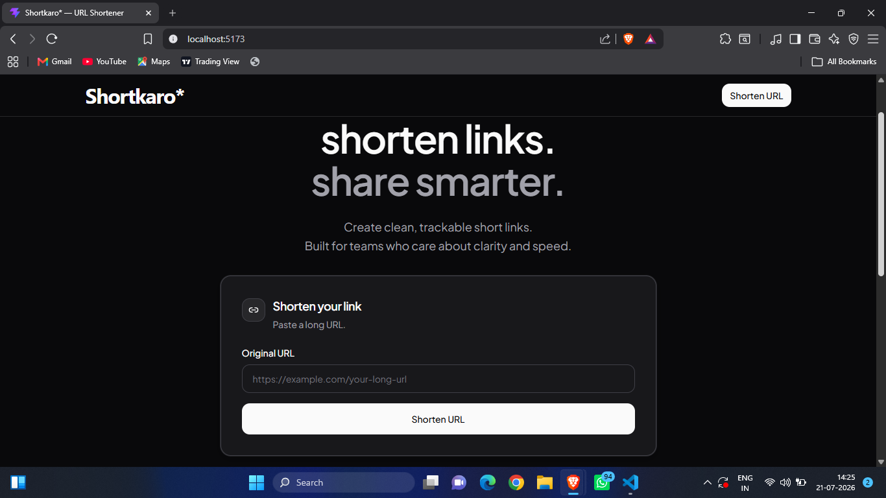
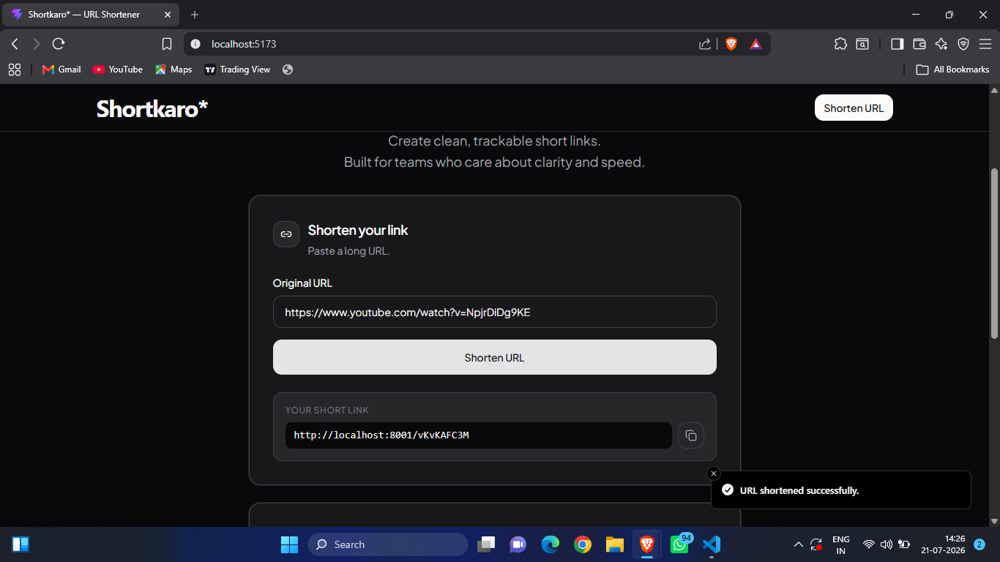
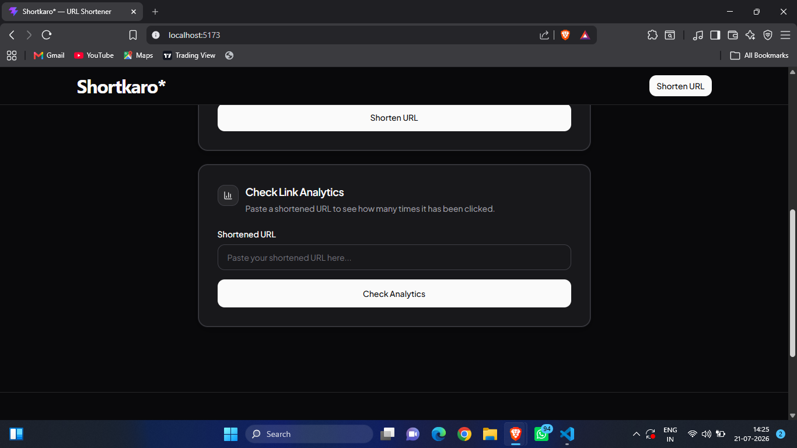
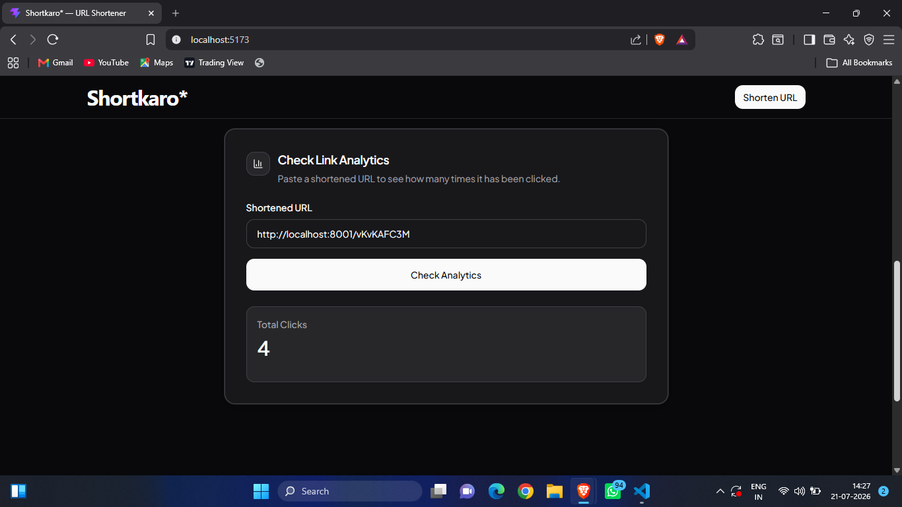

# 🚀 ShortKaro - URL Shortener with Click Analytics

<p align="center">
  <strong>A modern full-stack URL shortener built with the MERN stack.</strong>
</p>

<p align="center">
  Generate short links instantly and track the number of clicks with a clean and responsive user interface.
</p>

---

## 📖 Overview

**ShortKaro** is a full-stack URL shortening application that converts long URLs into short, shareable links. Every shortened URL is stored in MongoDB and includes click analytics so users can monitor how many times a link has been visited.

The project follows the **MVC architecture** on the backend and uses **React + Vite** on the frontend to deliver a fast and responsive user experience. 

---

## ✨ Features

- 🔗 Shorten long URLs instantly
- 📊 Track total clicks for every shortened URL
- ⚡ Fast redirection to the original website
- 📱 Fully responsive interface
- 🎨 Clean and modern UI
- 🗄️ MongoDB database integration
- 🏗️ MVC architecture for maintainable backend code
- 🌐 RESTful API

---

## 🛠️ Tech Stack

### Frontend

- React
- Vite
- Tailwind CSS
- Axios

### Backend

- Node.js
- Express.js
- MongoDB

---

# 📸 Screenshots

## Home Page



---

## URL Generated



---

## Analytics



---

## Analytics View



---

# 📂 Project Structure

```text
ShortKaro
│
├── backend
│   ├── controllers
│   ├── models
│   ├── routes
│   ├── service
│   ├── connection.js
│   ├── index.js
│   └── package.json
│
├── frontend
│   ├── public
│   ├── src
│   ├── package.json
│   └── vite.config.js
│
├── assets
│
├── .gitignore
│
└── README.md
```

---

# ⚙️ Installation

## Clone the repository

```bash
git clone https://github.com/vanshhg/ShortKaro.git
```

```bash
cd ShortKaro
```

---

## Backend Setup

```bash
cd backend
```

Install dependencies

```bash
npm install
```

Create a `.env` file

```env
MONGO_URI=your_mongodb_connection_string
PORT=8001
```

Run the backend

```bash
npm start
```

---

## Frontend Setup

```bash
cd frontend
```

Install dependencies

```bash
npm install
```

Start the development server

```bash
npm run dev
```

---

# 🔗 API Endpoints

### Create Short URL

```http
POST /url
```

### Redirect

```http
GET /:shortId
```

### Analytics

```http
GET /url/analytics/:shortId
```

---

# 📊 How It Works

1. User enters a long URL.
2. Backend generates a unique Short ID.
3. URL is stored in MongoDB.
4. User receives a shortened URL.
5. Every visit updates the click count.
6. Analytics endpoint returns the total clicks.

---

# 🚀 Future Improvements

- 👤 User Authentication
- 📈 Advanced Analytics Dashboard
- 🗑️ Delete Short URLs
- ✏️ Edit Existing URLs
- 📅 Link Expiration
- 🔒 Custom Short URLs
- 📱 QR Code Generator
- 🌙 Switch Light/Dark Mode

---

# 🤝 Contributing

Contributions are welcome!

If you'd like to improve this project, feel free to fork the repository and submit a pull request.

---

# 👨‍💻 Author

**Vansh Gangwal**

GitHub: https://github.com/vanshhg

---

## ⭐ Support

If you found this project helpful, consider giving it a **⭐ Star** on GitHub.
